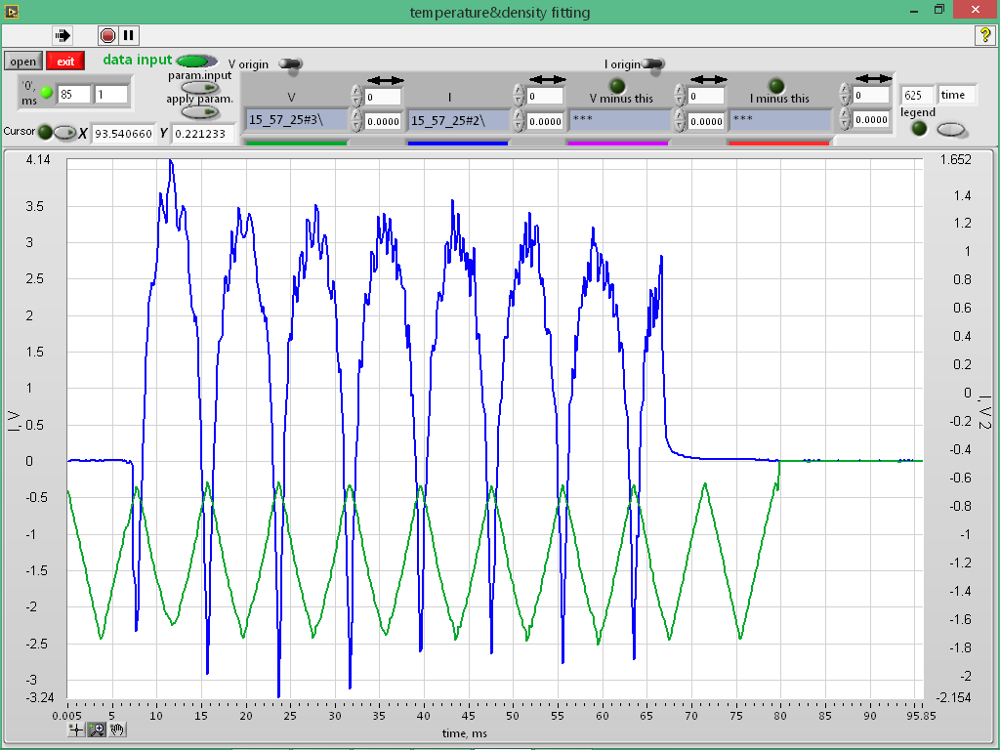
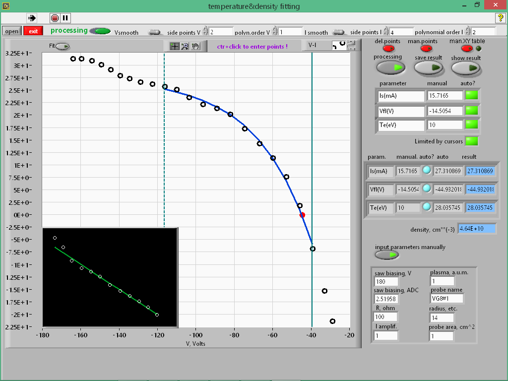

The LabView code for a single Langmuir probe V-I characteristics processing.
Nonlinear curve fitting is utilized in order to obtain plasma density,
electron temperature and floating potential.
Binary and text data formats can be used.
A standalone executable program can be easily compiled from this code.

For now it is possible to process the next binary formats:

1. L-Card L-783M, http://www.lcard.ru/products/boards/l-783
2. L-Card e20-10, http://www.lcard.ru/products/external/e20-10
3. SATURN SDI-AD12-128H, http://www.saturn-data.com

ADC files examples are included in the "resources/sampledata/" subfolder.
Check "resources/png/" subfolder with screenshots.

An information about every signal will be extracted from an appropriate
binary *.par file  in correspondence with a chosen binary *.dat file
or from the beginning of a chosen *.dat file in case of SATURN SDI-AD12-128H

